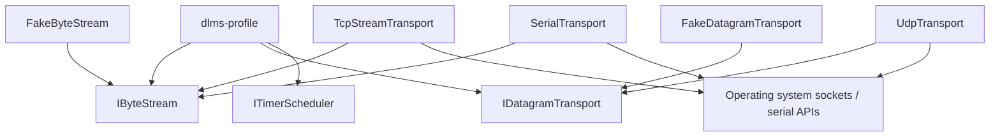
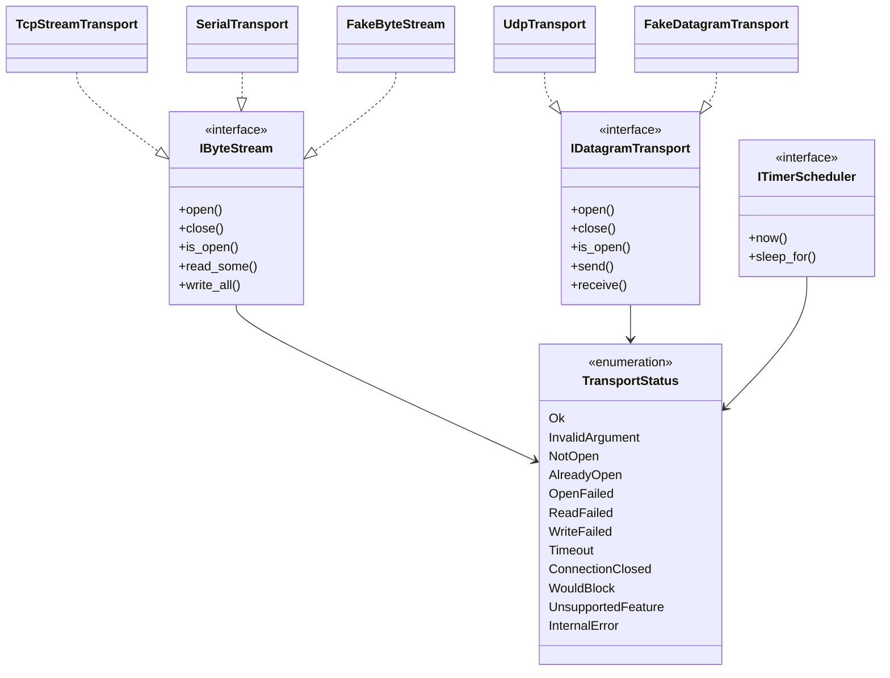
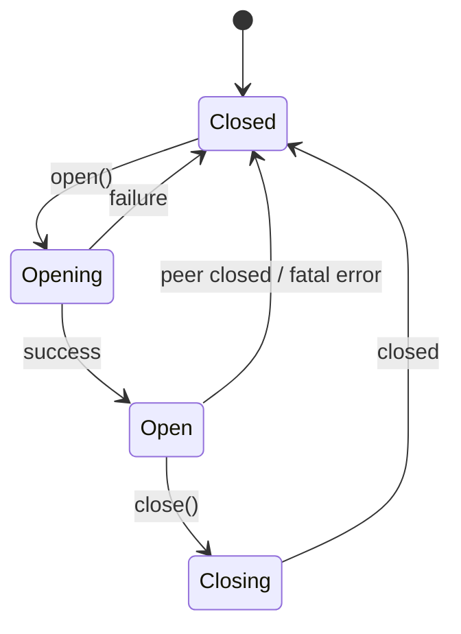

# Transport Architecture

## 1. Scope

`dlms-transport` is the protocol-neutral I/O layer for the DLMS/COSEM framework.

It owns operating-system-facing communication primitives and presents small,
testable interfaces to upper layers. It does not know what bytes mean.

## 2. In Scope

- byte-stream abstraction for TCP and serial transports;
- datagram abstraction for UDP;
- timer abstraction for higher-layer timeout policies;
- fake transports for deterministic tests;
- caller-provided-buffer APIs.

## 3. Out of Scope

- HDLC frame parsing;
- LLC LPDU parsing;
- Wrapper WPDU parsing;
- APDU parsing;
- Application Association state machine;
- COSEM object model;
- security policy and cryptographic execution.

## 4. Layer Diagram



## 5. Module Layout

Planned layout:

```text
include/dlms/transport/transport_status.hpp
include/dlms/transport/byte_stream.hpp
include/dlms/transport/datagram_transport.hpp
include/dlms/transport/timer_scheduler.hpp
include/dlms/transport/fake_transport.hpp
include/dlms/transport/tcp_stream_transport.hpp
include/dlms/transport/udp_transport.hpp
include/dlms/transport/serial_transport.hpp
src/transport/*.cpp
test/transport/*.cpp
```

TCP, UDP, and serial implementations may be split by platform when required.
The public interfaces should remain platform-neutral.

The initial committed API includes the protocol-neutral interfaces and fake
transports. Concrete TCP, UDP, and serial implementations are planned follow-up
modules.

## 6. Class Interaction Diagram



## 7. State Model

Concrete transports should use a small state model:



`close()` should be idempotent and should leave the object in `Closed`.

## 8. Error Model

Transport errors describe I/O and lifecycle failures only.

Examples:

- `Timeout`: no bytes or datagram arrived before the configured deadline.
- `ConnectionClosed`: peer closed an established stream.
- `ReadFailed`: operating system read call failed for a non-timeout reason.
- `WriteFailed`: operating system write call failed for a non-timeout reason.
- `InvalidArgument`: caller passed invalid pointers, sizes, or options.

Invalid HDLC, Wrapper, or APDU bytes must be returned to upper layers as raw
bytes when I/O succeeds. They are not transport validation failures.

## 9. Testing Strategy

Tests should be layered:

- interface-contract tests using fake transports;
- loopback TCP tests for real byte-stream behavior;
- loopback UDP tests for datagram behavior;
- serial tests only when a deterministic virtual serial setup is available.

Unit tests in this repository should avoid live meters and external network
dependencies.
